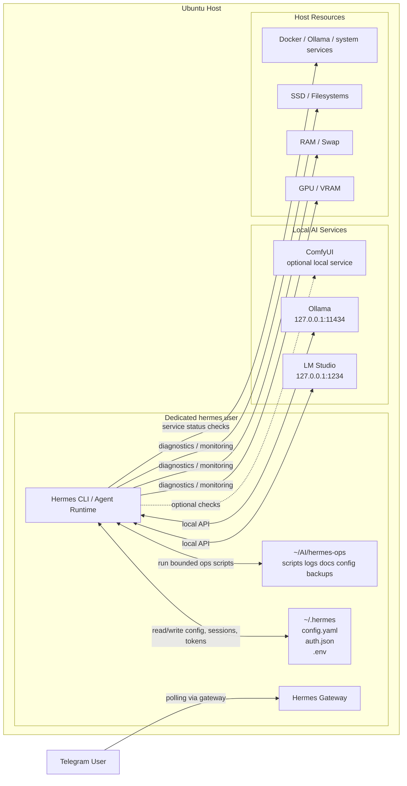

# Hermes Ops Architecture

## Objective
Deploy Hermes Agent as an operator for the local AI stack, with direct access to diagnostics and automation, while reducing blast radius through least-privilege execution and localhost-only integrations.

## Proposed Topology
- Hermes Agent runs on the host, under a dedicated non-privileged user.
- Operational workspace remains in `~/AI/hermes-ops/`.
- Hermes state and secrets stay under `~/.hermes/`.
- Local model backends remain separate services:
  - `LM Studio` on `127.0.0.1:1234`
  - `Ollama` on `127.0.0.1:11434`
- Telegram is connected through the Hermes gateway in polling mode first, avoiding inbound public exposure.

## Security Boundaries
- No `sudo` for Hermes runtime.
- No external bind for dashboard or local model APIs.
- No webhook exposure in the initial setup.
- Secrets stored only in `.env`/Hermes auth files, never in repository docs.
- Future automation should stay inside `~/AI/hermes-ops/scripts/` and default to read-only or dry-run behavior.

## Renderable Diagram

## Accepted Risks
- Running Hermes on the host gives it direct access to the dedicated user context.
- A compromised Hermes session or leaked token could affect files and services reachable by that user.
- Telegram adds a remote control surface, even when using polling.

## Initial Mitigations
- Use a dedicated runtime user instead of the main personal account.
- Restrict Hermes working directories to the ops workspace where possible.
- Keep model servers on localhost only.
- Prefer polling over webhook for Telegram.
- Delay any systemd installation or auto-start until the manual workflow is stable.
- Introduce terminal isolation later if needed through Hermes terminal backend configuration such as Docker or SSH.

## Next Hardening Steps
1. Create the dedicated `hermes` user and isolate file ownership.
2. Set Hermes terminal working directory to the ops workspace.
3. Validate Telegram in polling mode before considering any always-on service.
4. Review whether shell execution should later move to a Docker or SSH backend.
